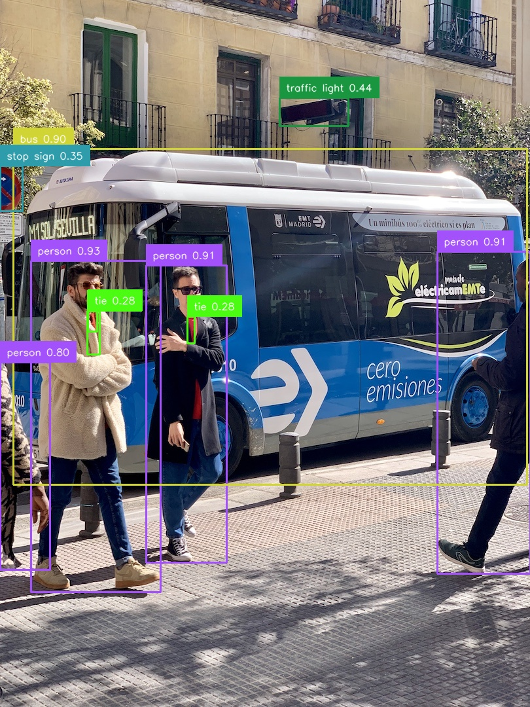
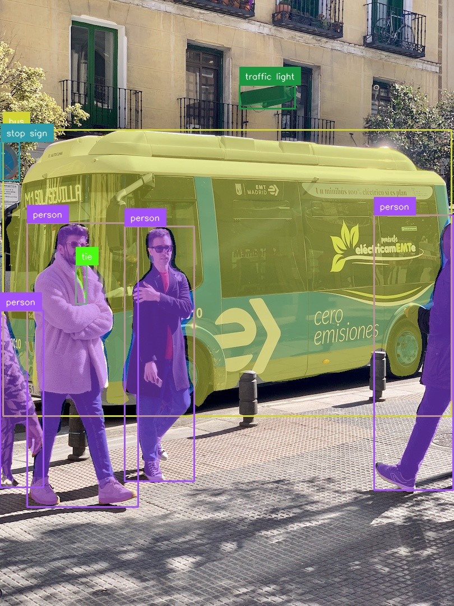
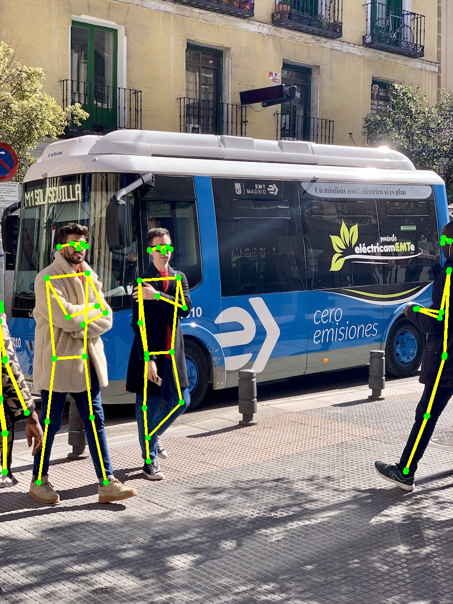
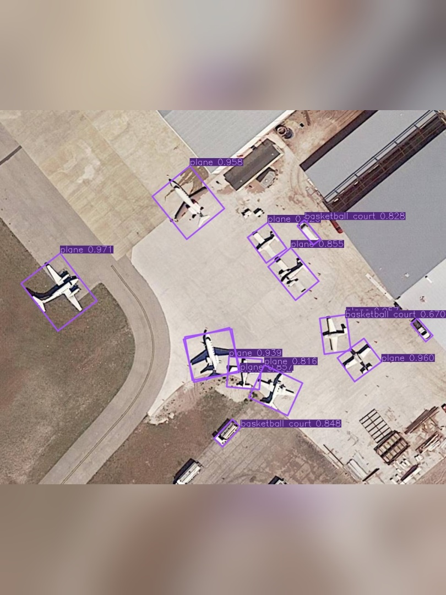

English | [简体中文](README.md)

# TensorRT-DETR

[](LICENSE)
[]()
[]()
[]()

TensorRT-DETR is a C++/CUDA/TensorRT inference deployment library for NVIDIA GPUs. It provides C++ and Python APIs currently covering object detection, instance segmentation, pose estimation, and oriented object detection (OBB).

<div align="center">
  
  
  
  
  <p><em>Detection · Segmentation · Pose Estimation · OBB</em></p>
</div>

## ✨ Features

- 🚀 Tasks: Detect / Segment / Pose / OBB (Oriented Bounding Box)
- ⚡ Built on the [TensorRT-YOLO](https://github.com/laugh12321/TensorRT-YOLO) inference kernel: CUDA Stream + CUDA Graph acceleration, GPU-side letterbox preprocessing
- 🧠 Multiple memory strategies: Device / Unified / Mapped
- 🔗 Both C++ and Python APIs, one-click pybind11 wheel install
- 📦 Outputs plug directly into [supervision](https://github.com/roboflow/supervision) for zero-boilerplate visualization
- 🎯 Adapted for DETR-family models exported by [EdgeCrafter](https://github.com/Intellindust-AI-Lab/EdgeCrafter): ONNX needs only the single `images` input

## 🚀 Quick Start (Python)

```bash
pip install dist/trtdetr-*.whl
```

```python
import cv2
from trtdetr import TRTDETR

model = TRTDETR("model.engine", task="detect", profile=True, swap_rb=True, conf_thresh=0.25)
image = cv2.imread("image.jpg")
result = model.predict(image)
print(result)
```

More Python examples are available under [examples/python](examples/python/).

## 📊 Performance

Measured on an RTX 4070 Ti SUPER (batch=1, FP16 engine, 640×640 input):

| Task | Model | Throughput (QPS) | CPU Latency | GPU Latency |
|------|-------|------------------|-------------|-------------|
| Detect | ecdet_s | 239 | 4.18 ms | 4.16 ms |
| Segment | ecseg_s | 115 | 8.73 ms | 8.72 ms |
| Pose | ecpose_s | 255 | 3.92 ms | 3.91 ms |
| OBB | rtdetrv2_obb_hgnetv2_s | 413 | 2.42 ms | 2.40 ms |

## 📑 Table of Contents

- [TensorRT-DETR](#tensorrt-detr)
  - [✨ Features](#-features)
  - [🚀 Quick Start (Python)](#-quick-start-python)
  - [📊 Performance](#-performance)
  - [📑 Table of Contents](#-table-of-contents)
  - [Requirements](#requirements)
  - [🔨 Build and Install](#-build-and-install)
  - [📦 Model Conversion](#-model-conversion)
  - [🧩 C++ Examples](#-c-examples)
  - [🐍 Python Usage](#-python-usage)
  - [🔧 C++ Usage](#-c-usage)
  - [License](#license)
  - [🙏 Acknowledgements](#-acknowledgements)

## Requirements

- CUDA
- TensorRT
- CMake >= 3.18
- C++17 compiler
- Optional Python binding dependencies: Python Development, pybind11, pip

## 🔨 Build and Install

Build the C++ library only:

```bash
cmake -S . -B build \
  -DTRT_PATH=/path/to/tensorrt \
  -DCMAKE_INSTALL_PREFIX=/path/to/install
cmake --build build -j$(nproc) --config Release --target install
```

Build Python bindings and generate a wheel:

```bash
pip install "pybind11[global]"
cmake -S . -B build \
  -DTRT_PATH=/path/to/tensorrt \
  -DBUILD_PYTHON=ON \
  -DCMAKE_INSTALL_PREFIX=/path/to/install
cmake --build build -j$(nproc) --config Release
pip install dist/trtdetr-*.whl
```

With `BUILD_PYTHON=ON`, the build generates `dist/trtdetr-*.whl`

## 📦 Model Conversion

The models supported by this project are mainly converted from [EdgeCrafter](https://github.com/Intellindust-AI-Lab/EdgeCrafter). The Python export flow in EdgeCrafter has been partially modified for model conversion; see [assets/export_onnx.py](assets/export_onnx.py). The exported ONNX keeps only the image input `images` and does not require extra inputs such as the original image size.

In addition, oriented object detection (OBB) is based on [RiO-DETR](https://github.com/RicePasteM/RiO-DETR). Its official ONNX has a single `images` input with three outputs (`labels`/`boxes`/`scores`) and can be built into an engine with `trtexec` directly; see [assets/export/README.md](assets/export/README.md) for conversion details.

After exporting ONNX, you can continue using the TensorRT toolchain to build an engine and deploy inference with this project.

## 🧩 C++ Examples

Build examples from the repository root:

```bash
cmake -S . -B build \
  -DTRT_PATH=/path/to/tensorrt \
  -DBUILD_EXAMPLES=ON
cmake --build build -j$(nproc) --config Release --target detect segment pose obb mutli_thread
```

Individual examples can be toggled:

```bash
cmake -S . -B build \
  -DTRT_PATH=/path/to/tensorrt \
  -DBUILD_EXAMPLES=ON \
  -DBUILD_EXAMPLE_DETECT=ON \
  -DBUILD_EXAMPLE_SEGMENT=OFF \
  -DBUILD_EXAMPLE_POSE=OFF \
  -DBUILD_EXAMPLE_OBB=OFF \
  -DBUILD_EXAMPLE_MULTI_THREAD=OFF
```

See [examples/README.md](examples/README.md) for details.

## 🐍 Python Usage

```python
import cv2
from trtdetr import TRTDETR

model = TRTDETR("model.engine", task="detect", profile=True, swap_rb=True, conf_thresh=0.25)
image = cv2.imread("image.jpg")
result = model.predict(image)
print(result)
```

python examples are available under [examples/python](examples/python/).

## 🔧 C++ Usage

```cpp
#include <iostream>
#include <opencv2/opencv.hpp>
#include "trtdetr.hpp"

int main() {
    trtdetr::InferOption option;
    option.enableSwapRB();
    option.setConfThresh(0.5f);

    trtdetr::DetectModel model("model.engine", option);
    cv::Mat image = cv::imread("image.jpg");
    trtdetr::Image input(image.data, image.cols, image.rows);

    auto result = model.predict(input);
    std::cout << result << std::endl;
    return 0;
}
```
cpp examples are available under [examples/cpp](examples/cpp/).

## License

This project is licensed under GPL-3.0. See [LICENSE](LICENSE) for details.

## 🙏 Acknowledgements

This project is mainly derived from [TensorRT-YOLO](https://github.com/laugh12321/TensorRT-YOLO), and the model conversion flow mainly references [EdgeCrafter](https://github.com/Intellindust-AI-Lab/EdgeCrafter). It has been reorganized and adapted based on the related inference framework and model export flow. Thanks to the related open-source projects for their contributions to the TensorRT deployment ecosystem.
